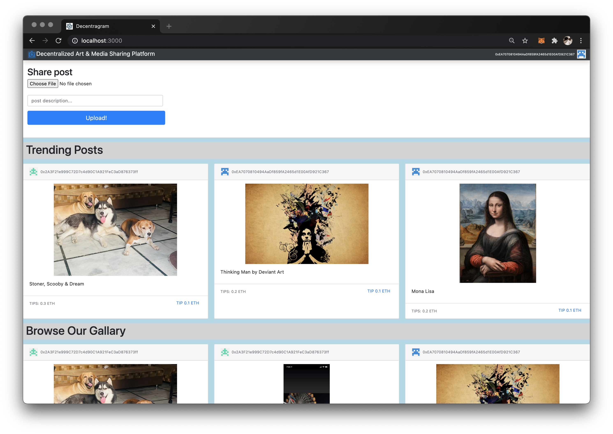
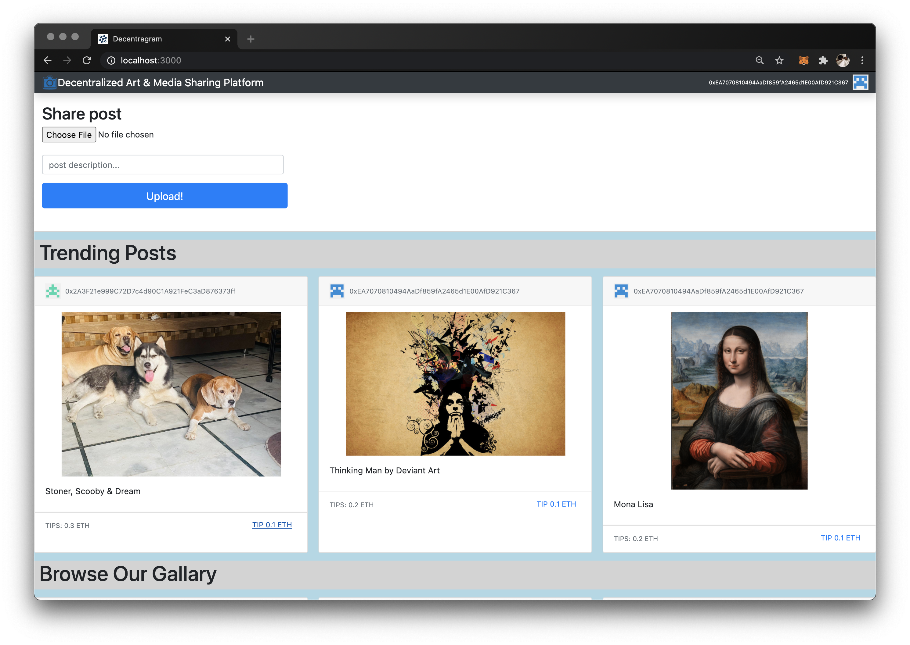

## `Decentralized Art & Media Sharing Platform.`

### Welcome to the new way Media Sharing & Being Incentivized

    -- Here rather than simply sharing for the sake of it, you can share your posts/media and be tokenized by users who like/tip your post, directly from their account to yours, without the service-provider's acting as middlemen.

    -- This app uses IPFS to store your media in a de-centralized secure file storing network

    -- The media file hashe's are then mapped with the Ethereum Wallet Account that approved the transaction or uploaded the post.

    -- This ensures no other account can view/tamper with the documents on another account

    -- The contracts are written in Solidity Language, and tested and deployed using Ganache and Truffle Framework

    -- The Client Side app is developed using React.JS & Web3.js

    -- The tests are written using Chai Framework

## Screen shots Of the Running App

### HomePage

(The client side front-page)

### File Upload

(The media upload transaction confirmation by metamask)

### Tipiing and Amount

(The tipping amount decided by the contract)

## Available Scripts

## Starting the Block Chain Network and Deploying the contracts

#### Install Ganache, Truffle Framework, and Metamask Browser Extention

In the project directory, you can run:

### `npm install`

Installs all the necessary packages to run the app i development mode.\

The cosole will show if the packages were successfully installed.\
You will also see any lint errors in the console.

### `truffle migrate --reset`

Deploys the contract on the network, and resets any other version of the contract on the network.

### `truffle console`

Open up the truffle console to test or check the network details.

### `truffle test`

To test the basic tests

## Client Side

### `npm run start`

Runs the app in the development mode.\
Open [http://localhost:3000](http://localhost:3000) to view it in the browser.

The page will reload if you make edits.\
You will also see any lint errors in the console.

# NOTE

you will need metamask extention on your browser, and the ganache account linked to the metamask accounts.
